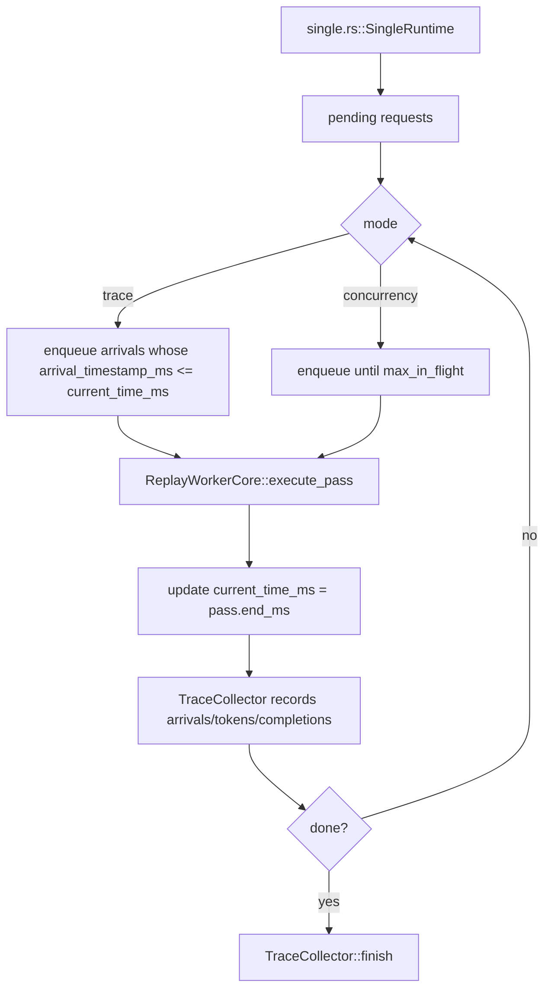
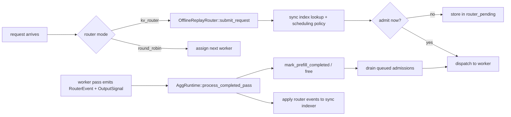

# 离线回放 Harness

本目录包含 `pagoda_mocker::replay` 使用的进程内离线回放 harness。

它的目标是在不启动异步 runtime、不启动网络平面、也不启动真实 worker task 的情况下，模拟 trace 的执行过程。具体做法是：harness 推进一个逻辑时钟，直接驱动 mock engine core，并把请求和 token 的时间信息记录到 `lib/mocker/src/replay/collector.rs` 中的 `TraceCollector`。

本文档重点说明离线回放自身的内部机制：逻辑时钟、事件队列、每个 worker 的状态机。

## 所在位置

公开的 replay 入口位于上一级目录：

```text
lib/mocker/src/replay/entrypoints.rs
```

这些入口负责：

- 规范化 `MockEngineArgs`；
- 加载或接收 `DirectRequest`，或者接收 `loadgen::Trace` workload；
- 校验 replay 参数；
- 分发到 offline replay 或 online replay。

离线回放从这里开始：

```text
lib/mocker/src/replay/offline/mod.rs
```

`offline/mod.rs` 会在三种实现之间选择：

- `lib/mocker/src/replay/offline/single.rs`：用于 `num_workers == 1` 且 engine 为 vLLM 的特殊快速路径；
- `lib/mocker/src/replay/offline/agg.rs`：用于其它情况，包括 aggregated 多 worker replay 和 `kv_router` replay；
- `lib/mocker/src/replay/offline/disagg.rs`：用于离线 disaggregated prefill/decode replay。

## 文件地图

- `lib/mocker/src/replay/offline/mod.rs`  
  选择 single-worker 快速路径或 multi-worker harness。

- `lib/mocker/src/replay/offline/single.rs`  
  面向单个 vLLM worker 的最小 replay loop。

- `lib/mocker/src/replay/offline/agg.rs`  
  通用离线集群模拟器，用于 multi-worker replay 和 KV-router replay。

- `lib/mocker/src/replay/offline/disagg.rs`  
  离线两阶段 replay harness，包含独立的 prefill worker 池和 decode worker 池。

- `lib/mocker/src/replay/offline/state.rs`  
  对 `EngineCore` 的 per-worker 封装，同时包含可选 KV event capture。

- `lib/mocker/src/replay/offline/events.rs`  
  `SimulationEvent` 与 `SimulationEventKind` 优先级队列类型，供 multi-worker harness 使用。

- `lib/mocker/src/replay/offline/core.rs`  
  `ReplayWorkerCore` 小型封装，供 single-worker 路径使用。

- `lib/mocker/src/replay/offline/runtime_utils.rs`  
  `agg.rs` 和 `disagg.rs` 共用的工具函数，包括 `WorkerCompletionPayload`、事件调度和 `next_timestamp`。

- `lib/mocker/src/replay/offline/progress.rs`  
  `ReplayProgress`，基于 `indicatif` 的进度条，由各个 harness 使用。

- `lib/mocker/src/replay/offline/components/`  
  从 runtime 中拆出来的共用抽象：

  - `router.rs` — `OfflineReplayRouter`，进程内同步 router，支持 KV 模式和 round-robin 模式；同时包含 `OfflineRouterSnapshot`。
  - `engine.rs` — `EngineComponent`、`EngineEffects`、`EnginePassMode`，围绕 `EngineCore` 的包装层。
  - `admission.rs` — admission queue，以及 trace / workload 请求准入控制。
  - `types.rs` — `WorkerAdmission`、`RouterEffects`、`ScheduledWorkerCompletion`、`TrafficAccumulator`、`TrafficStats`、`ReplayMode`。
  - `mod.rs` — 统一 re-export。

## Single-Worker 快速路径

single-worker 路径刻意保持简单，只在以下条件同时满足时使用：

- `num_workers == 1`
- engine 类型是 `vllm`

这条路径完全绕过集群事件队列和 router 机制，但现在同时支持：

- flat request replay；
- 通过 `WorkloadDriver` 驱动的 workload replay，用于多轮 / session trace。



重要细节：

- Trace 模式会使用 `lib/mocker/src/replay/mod.rs` 中的 `normalize_trace_requests`，让第一个请求从 `0 ms` 开始，然后再应用 `arrival_speedup_ratio`。
- Concurrency 模式会忽略原始 arrival 间隔，并尽量让 worker 保持到 `max_in_flight` 的填充状态。
- Workload trace 模式会遵守首轮 turn 的时间戳和 turn 之间的 delay。
- Workload concurrency 模式会忽略首轮 turn 的时间戳，但仍然会在上一个 turn 完成之后执行 inter-turn delay。
- worker 本身仍然是真正的 mocker engine core；被简化的只是外层调度循环。

## Multi-Worker Harness

通用 aggregated harness 位于：

```text
lib/mocker/src/replay/offline/agg.rs
```

它模拟一个集群，其中包含：

- 一个逻辑时钟 `now_ms`；
- 一个 pending request queue；
- 每个 worker 一个 [`OfflineWorkerState`](/Users/peabrane/Documents/codes/dynamo/lib/mocker/src/replay/offline/state.rs)；
- 一个保存未来 completion events 的二叉堆；
- 一个可选的同步 offline router。

### 主循环

aggregated harness 是事件驱动的。它不会 sleep。相反，`AggRuntime` 会反复执行：

1. 选择下一个有意义的时间戳；
2. 推进 `now_ms`；
3. 应用所有在该时间点发生的 worker completion events；
4. 根据 trace arrival 或 concurrency backfill 接纳新请求；
5. 在 ready worker 上启动新的 pass；
6. 把新的 `WorkerCompletion` events 放回二叉堆。

`now_ms` 只会推进到下一个有意义的时间点：

- 下一个请求到达时间；
- 下一个 worker completion event。

### Worker 模型

每个 worker 由 `lib/mocker/src/replay/offline/state.rs` 中的 `OfflineWorkerState` 表示：

- 包装一个 `EngineCore`；
- 跟踪当前是否有一个 pass 正在执行；
- 单独跟踪 in-flight request 数量，不完全依赖 engine 内部状态；
- 当 replay 使用 `kv_router` 模式时，可以开启 KV event capture。

pass 的执行逻辑仍然来自真正的 scheduler core：

- `VllmCore::execute_pass(...)`
- `SglangCore::execute_pass(...)`

因此，offline replay 不是一个玩具级模拟器。它复用了真实的 per-pass mocker 调度逻辑，只是以确定性的方式驱动它。

## Completion Event Queue

multi-worker 和 disagg harness 使用 `lib/mocker/src/replay/offline/events.rs` 中的 `SimulationEvent` 作为按时间排序的优先级队列。底层用 `BinaryHeap` 实现。事件本身是一个小结构，包含调度时间戳、用于打破同一时间排序冲突的序号，以及一个带类型的 payload：

```rust
pub(crate) struct SimulationEvent {
    pub(crate) at_ms: f64,
    pub(crate) seq_no: u64,
    pub(crate) kind: SimulationEventKind,
}

pub(crate) enum SimulationEventKind {
    WorkerCompletion { stage, worker_idx, completed_requests, output_signals, kv_events },
    DecodeHandoff { uuid },
    WorkerReady { stage, worker_id },
}
```

- `WorkerCompletion` 会在一个 worker pass 执行之后产生，并在 harness 时钟到达 `pass.end_ms` 时被应用。它携带 `stage`，即 `Aggregated`、`Prefill` 或 `Decode`，还携带 `worker_idx`、`completed_requests`、`output_signals` 和 router 可见的 `kv_events`。
- `DecodeHandoff` 用于 disaggregated harness，在同一个逻辑时间戳把请求从 prefill 阶段移动到 decode 阶段，下面会详细说明。
- `WorkerReady` 表示某个 worker 的 pass 完成之后，重新回到 admission pool 的时间点。

## Router 集成

Offline replay 可以运行在两种 router 模式下：

- `round_robin`
- `kv_router`

offline 模式下的 router 实现在：

```text
lib/mocker/src/replay/offline/components/router.rs
```

对应类型是 `OfflineReplayRouter`。

这个 router 是同步的、进程内的：

- 没有异步 worker task；
- 没有 event plane；
- 没有后台 indexer 线程。

它内部维护：

- 一个本地 radix tree indexer；
- 本地 `ActiveSequencesMultiWorker` 状态；
- 一个用于排队请求的 pending queue。



### 为什么只在需要时捕获 KV events

当 offline replay 使用 `kv_router` 时，worker 会通过以下入口启用 KV event capture：

- `lib/mocker/src/scheduler/vllm/core.rs` 中的 `VllmCore::new_with_kv_capture`
- `lib/mocker/src/scheduler/sglang/core.rs` 中的 `SglangCore::new_with_kv_capture`

这样每个 pass 都会返回 router 可见的 `kv_events`，harness 会在 pass 完成后把这些事件同步应用到 offline router indexer。

在 round-robin 模式下，这些事件没有消费者，所以会跳过 capture。

在 offline disagg replay 中，只有 prefill worker 会捕获并发布 KV events；decode worker 会关闭 capture，因为 decode router 是 overlap-blind 的，不消费 router events。

## Disaggregated Harness

`lib/mocker/src/replay/offline/disagg.rs` 中的 disaggregated runtime 模拟两个不同阶段：

- prefill router 和 prefill worker pool；
- decode router 和 decode worker pool。

它使用一个逻辑时钟和一个 completion-event heap，但请求所有权会通过两阶段状态机迁移，而不是像 aggregated 模式那样在单个 worker pool 生命周期中完成。

prefill router 来自主 router 配置，但会设置：

```text
router_track_active_blocks = false
```

decode router 的派生配置为：

- 关闭 overlap；
- `assume_kv_reuse = false`；
- `track_prefill_tokens = false`。

prefill 阶段运行一个隐藏的 synthetic one-token bootstrap request。prefill 完成后，harness 会：

1. 应用所有 prefill KV events；
2. 在 prefill router 中标记 prefill complete；
3. 释放 prefill router 状态；
4. 在同一个逻辑时间戳把原始请求入队到 decode 阶段。

之后 decode 按照正常的 collector 可见性运行。公开的 replay report 仍然是 decode-only，因此 TTFT 会包含 prefill 排队时间和 prefill 计算时间。

## Trace 模式与 Concurrency 模式

single harness 和 multi harness 都支持两种 admission 模式。

### Trace 模式

- 对 flat requests，遵守输入中的 arrival timestamps；
- 对 workloads，遵守 first-turn timestamps 和 inter-turn delays；
- 时间戳会被规范化，使第一个请求或第一个 session 从 `0 ms` 开始；
- `arrival_speedup_ratio` 会压缩或拉伸请求间隔和 inter-turn delays。

### Concurrency 模式

- 忽略原始 first-turn spacing；
- 保持集群中最多有 `max_in_flight` 个常驻请求；
- 对 workloads，后续 turn 仍然只能在前一个 turn 完成并经过 inter-turn delay 后解锁；
- 请求被接纳时会打上合成 arrival time。

正是因为这两种模式分离，`lib/mocker/src/replay/offline/mod.rs` 同时暴露了：

- `simulate_trace(...)`
- `simulate_concurrency(...)`

## 指标收集

两个 harness 都会把请求时序事件写入 `lib/mocker/src/replay/collector.rs` 中的 `TraceCollector`：

- arrival；
- admission；
- token emission；
- completion。

harness 本身不会在运行过程中增量计算最终吞吐或延迟指标。它只记录事件，然后由 `TraceCollector::finish()` 根据这些事件生成最终的 `TraceSimulationReport`，定义也在 `lib/mocker/src/replay/collector.rs` 中。

## 心智模型

理解 offline replay 最简单的方式是：

1. 复用真实的 mocker scheduling pass 逻辑。
2. 用确定性的逻辑时钟替代真实 wall-clock 异步执行。
3. 可选地，用同步的进程内 router 模型替代网络化 router 行为。
4. 把同样的请求生命周期时间点记录进 `TraceCollector`。

这样，harness 既能保持快速、可复现，又能在不启动 live runtime 的情况下尽量接近真实 scheduler 行为。
