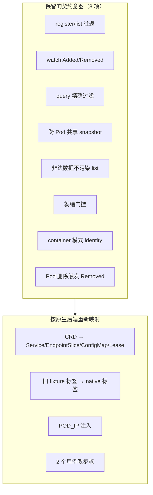

# K8s Discovery 集成测试迁移计划

本文档说明 Pagoda 从 **CRD 发现后端**（Dynamo 时代）迁移到 **K8s 原生对象后端** 后，`discovery.rs` / `common/contract.rs` 中 kube 集成测试应如何调整。

**结论先行：**

- **迁移已完成（Phase 1–3）。** 8 个 kube 用例已对齐原生 `Service` / `EndpointSlice` / `ConfigMap` discovery；harness 默认**方案 B**（合成 `podIP`）。
- **契约意图未改**：register/list/watch、过滤、跨 Pod、非法对象容错、ready 门控、container 模式、Pod 删除 GC。
- **Release 验证**：`cargo test -p pagoda-runtime --test discovery --features integration-kube kube -- --test-threads=1 --include-ignored` 或 `./lib/runtime/tests/run_tests.sh release`（需稳定 `kubectl` / API）。

---

## 1. 背景：生产代码已变，测试未跟进

### 1.1 Dynamo（测试编写时的假设）

| 维度 | 实现 |
|------|------|
| 持久化 | `DynamoWorkerMetadata` CRD（`discovery/kube/crd.rs`） |
| Daemon | watch **EndpointSlice + CRD**（Pod 模式）或 **Pod**（Container 模式） |
| 就绪标签 | `nvidia.com/dynamo-discovery-backend=kubernetes` |
| `PodInfo` | 仅需 `POD_NAME` / `POD_UID`，**无 `POD_IP`** |
| register | 写本地 metadata + `apply_cr` |

### 1.2 Pagoda-upstream（当前生产）

| 维度 | 实现 |
|------|------|
| 持久化 | `Service` + `EndpointSlice`（PortName）、`ConfigMap`（Model）、`Lease`（EventChannel） |
| Daemon | 四路 reflector：EndpointSlice / Service / ConfigMap / Lease（`discovery/kube/daemon.rs`） |
| 就绪标签 | `endpointslice.kubernetes.io/managed-by=pagoda-worker` + `bedicloud.com/pagoda-discovery-mode=native-service` |
| `PodInfo` | **强制 `POD_IP`**（写入 EndpointSlice addresses） |
| register | 写本地 metadata + `objects::register_portname_instance` 等 |

### 1.3 测试代码对比结论

`discovery.rs` 与 dynamo `integration_discovery.rs` 在 kube 模块上**逻辑同构**（856 行，diff 主要为 `Endpoint`→`PortName`、CRD 名称替换）。  
**失败原因不是用例写错，而是 harness 与注释仍描述 CRD 时代，且未满足新生产的前置条件。**

---

## 2. 策略选择：映射重构 vs 重新设想

### 2.1 推荐策略：**契约保留 + 场景映射**（非全盘重写）



| 策略 | 适用 | 说明 |
|------|------|------|
| **映射重构（采用）** | 6/8 用例 | 用户可见行为未变：`list` / `list_and_watch` / `register` / `unregister` 语义不变 |
| **改场景步骤** | 2/8 用例 | 原生模式下「元数据」与「就绪 slice」在 `register()` 时一并写入，旧「先 CR 后 slice」步骤不再成立 |
| **不采用：全盘新设计** | — | 除非要新增 Model/Lease 专项集成测试；当前 Release 范围以保持 PortName 契约为主 |

### 2.2 暂不在本阶段新增的测试（可选后续）

- Model `ConfigMap` register/list 专项
- EventChannel `Lease` TTL / 过期
- 多 portname 共享同一 Service 的 merge 行为
- `unregister` 后 Service 端口清理

以上可在 PortName 矩阵稳定后作为 Phase 2 扩展，**不阻塞**本次迁移。

---

## 3. 逐用例迁移对照表

图例：

- **意图**：对用户/上层契约是否仍要测 — 一般 **不变**
- **场景步骤**：测试操作序列 — **部分要改**
- **生产逻辑引用**：注释中的代码锚点 — **必须更新**
- **Harness**：`contract.rs` fixture — **必须更新**

| # | 用例名 | 意图是否保留 | 场景步骤 | 变更级别 |
|---|--------|-------------|----------|----------|
| 1 | `kube_discovery_register_list_roundtrip` | ✅ 保留 | 不变：`register` → `wait_for_discovery_list` | **小**：harness + 注释 |
| 2 | `kube_discovery_watch_sees_register_and_unregister` | ✅ 保留 | 不变 | **小** |
| 3 | `kube_discovery_filters_exact_namespace_component_endpoint` | ✅ 保留 | 不变 | **小** |
| 4 | `kube_discovery_cross_pod_shares_instances` | ✅ 保留 | 不变 | **小**（双 Pod 各需 `POD_IP`） |
| 5 | `kube_discovery_list_ignores_invalid_native_object_data` | ✅ 保留（容错） | CRD → 非法 Model ConfigMap | **大** ✅ |
| 6 | `kube_discovery_requires_ready_endpoint_slice` | ✅ 保留（就绪门控） | patch `ready=false/true` | **大** ✅ |
| 7 | `kube_container_mode_register_list_roundtrip` | ✅ 保留 | 简化 fixture（见 §4.4） | **中** |
| 8 | `kube_discovery_pod_delete_removes_from_watch` | ✅ 保留 | 不变（删 Pod → ownerRef GC slice） | **小**（注释更新） |

---

## 4. 逐用例详细说明

### 4.1 `kube_discovery_register_list_roundtrip` — 小改

**意图（不变）：** 单 Pod 上 `register` / `list` 往返，`instance_id` 一致。

**旧场景描述（过时）：**

> `register_internal` + `apply_cr` 持久化 `PagodaWorkerMetadata`

**新场景描述：**

> `KubeDiscoveryClient::register` 写本地 metadata 并调用 `objects::register_portname_instance`，在 Pagoda namespace 对应 K8s namespace 中创建 `Service` + `EndpointSlice`；daemon 聚合后 `list` 可见。

**步骤（不变）：**

1. `kube_runtime()`（Pod + 可选 fixture）
2. `discovery().register(spec)`
3. `wait_for_discovery_list(..., 1)`
4. `unregister` + `fixture.teardown()`

**Harness 变更：**

- `kube_runtime_for_identity` 注入 `POD_IP`（§5.1）
- fixture 创建的「预置」EndpointSlice 可**删除或改为 native 标签**；原生路径下 `register()` 自建 slice，预置 slice 非必须

---

### 4.2 `kube_discovery_watch_sees_register_and_unregister` — 小改

**意图（不变）：** `list_and_watch` 能收到 `Added` / `Removed`。

**生产逻辑（更新）：**

- `list_and_watch` 消费 `DiscoveryDaemon` 的 `watch::Receiver<MetadataSnapshot>`（非 CRD `metadata_watch`）

**步骤（不变）。**

---

### 4.3 `kube_discovery_filters_exact_namespace_component_endpoint` — 小改

**意图（不变）：** `DiscoveryQuery::PortName` 三元组精确过滤，不泄漏邻域。

**生产逻辑（更新）：**

- 过滤发生在 `MetadataSnapshot::filter`（`discovery/metadata.rs`），数据来源为 daemon 聚合的 Service/EndpointSlice annotations

**步骤（不变）。**

---

### 4.4 `kube_discovery_cross_pod_shares_instances` — 小改

**意图（不变）：** Pod A 注册后，同 K8s namespace 内 Pod B 的 `KubeDiscoveryClient` 通过共享 daemon snapshot 能 `list` 到 A 的实例。

**生产逻辑（更新）：**

- Daemon 聚合 namespace 内全部 **native** EndpointSlice + Service，而非「EndpointSlice + CR」

**Harness 变更：**

- `kube_dual_pod_runtimes` 两次 `kube_runtime_for_identity` 均需 `POD_IP`（可同用 `127.0.0.1`，或各 Pod 不同 IP 若未来需要）

**步骤（不变）。**

---

### 4.5 `kube_discovery_list_ignores_invalid_cr_data` — **大改（重命名 + 新场景）**

**意图（保留）：** 集群中存在**无法恢复为合法 `DiscoveryInstance` 的原生对象**时，discovery `list` 不被污染。

**旧场景（失效）：**

- 对 bad pod apply `PagodaWorkerMetadata` CR（`spec.data` 非法）
- 集群无 CRD → **404**

**新场景（映射到原生后端）：**

任选其一（推荐 **方案 A**）：

| 方案 | 操作 | 验证的生产路径 |
|------|------|----------------|
| **A（推荐）** | 对 bad pod 所在 K8s namespace apply **带 `bedicloud.com/pagoda-kind=model` 但 data 缺字段** 的 ConfigMap | `model_instance_from_config_map` → `Err` / skip（`daemon.rs` 第 4 步） |
| B | apply **ready=true 但缺少 Service / annotations 不完整** 的 EndpointSlice | `endpoint_instance_from_service_and_slice` → `Ok(None)` / skip |
| C | apply **非法 JSON 的 `card.json`** 的 Model ConfigMap | `model_instance_from_config_map` → `Err` |

**推荐步骤（方案 A）：**

1. `good_fixture` / `bad_fixture` 各 `KubeReadinessFixture::install`（仅需 Pod；就绪由 register 自建 slice 亦可）
2. `kube_apply_invalid_model_configmap(bad_pod, ...)` — **新 helper，替代 `kube_apply_invalid_worker_metadata_cr`**
3. `good_pod` 上 `kube_runtime_for_identity` + `register`
4. `wait_for_discovery_list` 仅 1 条，且 `instance_id == hash_pod_name(good_pod)`

**用例重命名建议：**

```
kube_discovery_list_ignores_invalid_cr_data
  → kube_discovery_list_ignores_invalid_native_object_data
```

**删除：**

- `kube_apply_invalid_worker_metadata_cr`
- teardown 中对 `PagodaWorkerMetadata` CR 的 delete

---

### 4.6 `kube_discovery_requires_ready_endpoint_and_cr` — **大改（新场景步骤）**

**意图（保留）：** **就绪门控** — 仅有元数据、但 EndpointSlice 端点未 ready 时，实例**不进入** snapshot；ready 后才可见。

**旧场景（失效）：**

1. 仅创建 Pod（无 fixture EndpointSlice）
2. `register`（写 CR，无 ready slice）→ `list` 为空
3. `fixture.install_endpoint_slice()` → `list` 有 1 条

**失效原因：** 原生 `register_portname_instance` **同时**写入 Service/EndpointSlice 且 `ready=true`，步骤 2 会立即可见，与旧断言矛盾。

**新场景（映射就绪门控语义）：**

**方案 A（推荐）— patch ready=false：**

1. `kube_runtime` + `register` → `wait_for_discovery_list(..., 1)`（基线：正常可见）
2. 通过 K8s API 将 register 创建的 EndpointSlice 的 `endpoints[0].conditions.ready` patch 为 `false`
3. `kube_wait_for_daemon_settle()` → `wait_for_discovery_list(..., 0)`
4. patch 回 `ready=true` → `wait_for_discovery_list(..., 1)`

**方案 B — 仅测 register 前为空：**

1. `list` 在 register 前为空
2. register 后非空

该方案较弱，仅验证「无注册则无实例」，**不能**单独验证就绪门控，故作补充而非替代。

**用例重命名建议：**

```
kube_discovery_requires_ready_endpoint_and_cr
  → kube_discovery_requires_ready_endpoint_slice
```

**生产逻辑引用（更新）：**

- `daemon::aggregate` 第 6 步：`filter(|(id, _)| ready_pods.contains_key(id))`
- `extract_portname_info` 仅收集 `ready=true` 的 EndpointSlice 端点

---

### 4.7 `kube_container_mode_register_list_roundtrip` — 中改

**意图（保留）：** `PGD_KUBE_DISCOVERY_MODE=container` 且 `CONTAINER_NAME=main` 时，`instance_id == hash_pod_name(pod)`（与 Pod 模式 collapse 一致）。

**旧场景假设（过时）：**

> daemon 监视 Pod `containerStatuses.ready`

**新生产事实：**

- Daemon **不** watch Pod；就绪门控仍来自 **native EndpointSlice**
- Container 模式仅影响 `PodInfo.target` / `instance_id` 计算（`utils.rs`：`main` 容器名 collapse 为 pod 名）

**步骤（简化）：**

1. `KubeReadinessFixture::install`（或 `install_pod_only` + 依赖 register 建 slice）— **不再需要** `patch_pod_container_ready` 作为就绪来源
2. `kube_runtime_for_identity(..., "container", Some("main"))`
3. `register` → `wait_for_discovery_list(..., 1)`
4. 断言 `instance_id == hash_pod_name(pod_name)`

**可删除的 fixture 路径（迁移后）：**

- `install_container_mode` 中的 `patch_pod_container_ready` 若仅服务于旧 daemon，可标记 deprecated 或改为仅创建带 discovery labels 的 Pod

---

### 4.8 `kube_discovery_pod_delete_removes_from_watch` — 小改

**意图（不变）：** Pod 删除后 watch 收到 `Removed`。

**生产逻辑（更新）：**

> Pod 删除 → EndpointSlice/Service 的 `ownerReference` GC → ready 条目消失 → snapshot 移除 → `DiscoveryEvent::Removed`

**步骤（不变）：** `register` → Added → `fixture.delete_pod_and_clear_readiness()` → Removed

**注意：** 需确保 register 创建的 EndpointSlice 的 `ownerReference` 指向 fixture Pod（生产已如此）；删 Pod 应触发 GC。

---

## 5. `common/contract.rs` Harness 变更清单

### 5.1 必须做（P0）

| 项 | 文件位置 | 变更 |
|----|----------|------|
| 注入 `POD_IP` | `kube_runtime_for_identity` | `resolve_fixture_pod_ip` → 写入 `async_with_vars`（见 §5.4） |
| 更新集群探测文案 | `require_kube_cluster` | 去掉「install PagodaWorkerMetadata CRD」 |
| Native EndpointSlice 标签 | `create_endpoint_slice_for_pod` / `kube_discovery_resource_labels` | 使用 `MANAGED_BY_LABEL`/`MANAGED_BY_VALUE`、`REGISTRY_MODE_LABEL`/`REGISTRY_MODE_VALUE`（与 `service_registry.rs` 一致）；**同时**创建配对 **Service**（daemon 恢复 PortName 需要 `svc_index`） |
| 删除 CRD teardown | `teardown_kube_readiness_fixture` | 移除 `PagodaWorkerMetadata` DynamicObject delete |
| 删除 CRD helper | `kube_apply_invalid_worker_metadata_cr` | 替换为 `kube_apply_invalid_model_configmap`（或同类） |

### 5.2 建议做（P1）

| 项 | 变更 |
|----|------|
| `KubeReadinessFixture` 字段 `cr_name` | 重命名或删除（无 CR） |
| `kube_runtime()` | 评估是否仍需预置 fixture EndpointSlice；原生路径可简化为 **仅 ensure Pod 存在** |
| `Drop` teardown 竞态 | 测试失败时 `buffer's worker closed`：在 `teardown` 中对连接关闭类错误降级为 `warn`，或测试末尾显式 `teardown` 再 `drop(drt)` |
| 新 helper | `kube_patch_endpoint_slice_ready(client, namespace, slice_name, ready: bool)` — 供就绪门控用例 |
| 新 helper | `kube_find_register_endpoint_slice(client, pagoda_ns, pod_name, ...)` — 定位 register 创建的 slice |

### 5.3 常量对照（fixture 标签迁移）

| 旧（Dynamo/Pagoda 测试 harness） | 新（生产 `service_registry.rs`） |
|----------------------------------|----------------------------------|
| `nvidia.com/pagoda-discovery-backend=kubernetes` | `endpointslice.kubernetes.io/managed-by=pagoda-worker` |
| `nvidia.com/pagoda-discovery-enabled=true` | `bedicloud.com/pagoda-discovery-mode=native-service` |
| （无） | `kubernetes.io/service-name=<service_name>`（已有，保留） |

**重要：** 仅改 EndpointSlice 标签不够；daemon 从 **Service + EndpointSlice** 联合恢复 PortName。预置 fixture slice 时须 **同时 create 带 `registry-mode=native-service` 的 Service**，并写入 Pagoda annotations（`bedicloud.com/pagoda-namespace` 等），与 `objects.rs` 一致。

### 5.4 Fixture `POD_IP` 策略（方案 B 默认 + 方案 A 可选）

生产 `KubeDiscoveryClient::register` **必须**有非 loopback 的 `POD_IP`（写入 EndpointSlice `addresses[]`）。  
`cargo test` 进程不在 Worker Pod 里，harness 通过 `resolve_fixture_pod_ip()` 模拟生产注入的 `POD_IP`。

> **勿设 `POD_IP=127.0.0.1`**：会被忽略（EndpointSlice API 拒绝 loopback），并打印误导性 warn。

#### 环境变量

| 变量 | 方案 B | 方案 A | 默认 | 说明 |
|------|:------:|:------:|------|------|
| （无额外 env） | ✅ | | — | 方案 B 默认开启 |
| `KUBE_TEST_POD_USE_REAL_POD_IP` | | ✅ | 未设 | 设为 `1` / `true` / `yes` 启用方案 A |
| `KUBE_TEST_SYNTHETIC_POD_IP` | 可选 | — | `10.42.0.1` | 方案 B patch 到 Pod status 的 IP |
| `KUBE_TEST_POD_IMAGE` | 一般不用 | 常需 | `registry.k8s.io/pause:3.9` | fixture 容器镜像；内网集群方案 A 必改 |
| `POD_IP` | 可选 | 可选 | 未设 | 跳过 patch/轮询，直接注入 Runtime；**禁止 `127.x`** |
| `KUBECONFIG` | ✅ | ✅ | — | 集群 API 可达 |
| `POD_NAMESPACE` | 可选 | 可选 | `default` | 须与 Pagoda `namespace` / daemon watch 一致 |

#### 方案 B：日常用法（内网集群 / Phase 1 默认）


```bash
export KUBECONFIG=~/.kube/config-dynamo-it   # 按实际路径

# 若 shell 里残留旧变量，先清掉
unset POD_IP KUBE_TEST_POD_USE_REAL_POD_IP

cargo test -p pagoda-runtime --test discovery --features integration-kube kube \
  -- --test-threads=1 --include-ignored
```

#### 方案 A：验证真实 podIP 路径


**kind / minikube（能拉 pause）：**

```bash
unset POD_IP
export KUBE_TEST_POD_USE_REAL_POD_IP=1
# 默认 pause:3.9，一般无需 KUBE_TEST_POD_IMAGE

cargo test -p pagoda-runtime --test discovery --features integration-kube \
  kube_discovery_register_list_roundtrip -- --test-threads=1 --include-ignored --exact

cargo test -p pagoda-runtime --test discovery --features integration-kube kube \
  -- --test-threads=1 --include-ignored
```

**内网集群（拉不动外网 pause）：**

```bash
unset POD_IP
export KUBE_TEST_POD_USE_REAL_POD_IP=1
export KUBE_TEST_POD_IMAGE=192.168.10.62:8671/dl_images/dl_python:3.11.14-v1.1  # 换成节点能拉的镜像

cargo test -p pagoda-runtime --test discovery --features integration-kube kube \
  -- --test-threads=1 --include-ignored
```

**测完方案 A 后恢复默认：**

```bash
unset KUBE_TEST_POD_USE_REAL_POD_IP KUBE_TEST_POD_IMAGE
```

#### 跑完后检查残余资源

测试通过时 harness 会 teardown；失败时可能残留。在集群上执行：

```bash
# fixture Pod（推荐：按标签）
kubectl get pod -n default -l pagoda.test/fixture=true

# 旧残留（无标签时）
kubectl get pod -n default | grep -E 'kube-(itest|ctr|pod-a|pod-b|valid|invalid|ready)-'

# register 可能留下的 Service / EndpointSlice
kubectl get svc,endpointslice -n default \
  -l bedicloud.com/pagoda-discovery-mode=native-service
```

无输出 = 干净。清理：

```bash
kubectl delete pod -n default -l pagoda.test/fixture=true --ignore-not-found
kubectl get pod -n default -o name \
  | grep -E 'kube-(itest|ctr|pod-a|pod-b|valid|invalid|ready)-' \
  | xargs -r kubectl delete -n default
```

---

## 6. 文件级改动范围

| 文件 | 改动类型 |
|------|----------|
| `tests/common/contract.rs` | Harness 主改（P0 + P1） |
| `tests/discovery.rs` | 注释更新；2 个用例重命名 + 步骤；`#[ignore]` 文案 |
| `tests/TEST_CATALOG.md` | 去掉 CRD 要求；更新用例表与运行说明 |
| `tests/run_tests.sh` | 已有 `POD_IP`；补充注释指向本文档 |
| `tests/KUBE_DISCOVERY_TEST_MIGRATION.md` | 本文档（迁移完成后可勾选 checklist） |

**不改动：**

- `src/discovery/kube/*.rs` 生产实现（除非测试暴露真实 bug）
- file / etcd 模块测试

---

## 7. 实施阶段与工作量

### Phase 1 — 解锁 6 个小改用例（约 0.5–1 天）✅ 代码已落地

- [x] `POD_IP` 注入（默认合成 IP + `patch_pod_status_ip`；可选 `KUBE_TEST_POD_USE_REAL_POD_IP=1` 读真实 podIP；**禁止 `127.x`**）
- [x] `require_kube_cluster` 文案（去掉 CRD 要求）
- [x] fixture 标签 + Service 配对（`create_endpoint_slice_for_pod` 使用 native 标签；`install()` 简化为仅创建 Pod）
- [x] 删除 CRD teardown（`teardown_kube_readiness_fixture` 改为清理 Service + EndpointSlice）
- [x] 更新 `#[ignore]` / `TEST_CATALOG.md` / `run_tests.sh` 注释
- [x] **`kube_pagoda_namespace()`**：Pagoda `namespace` 必须与 `POD_NAMESPACE` 一致（daemon 只 watch 该 K8s namespace）
- [x] Phase 1 用例改用 `kube_pagoda_namespace()` + `unique_name` 隔离 servicegroup
- [x] **集群实测**：Phase 1 六项 green（方案 B 默认；`kubectl` + 可达 `KUBECONFIG`）

**已修改文件：**

| 文件 | 变更摘要 |
|------|----------|
| `tests/common/contract.rs` | `kube_pagoda_namespace`、`resolve_fixture_pod_ip`、合成/真实 podIP、native 标签/Service、去 CRD teardown |
| `tests/discovery.rs` | Phase 1 用例 namespace/注释/`#[ignore]` |
| `tests/TEST_CATALOG.md` | 去掉 CRD；标注 Phase 1/2 |
| `tests/run_tests.sh` | 指向本文档 |

**编译验证（已通过）：**

```bash
cargo test -p pagoda-runtime --test discovery --features integration-kube --no-run
```

**集群验证（在有 K8s 的环境执行）：**

```bash
export KUBECONFIG=~/.kube/config-dynamo-it   # 或你的 kubeconfig
# 默认方案 B：合成 podIP，无需 POD_IP / KUBE_TEST_POD_IMAGE

cargo test -p pagoda-runtime --test discovery \
  --features integration-kube kube -- --test-threads=1 --include-ignored
```

预期：**8 passed**。

### Phase 2 — 2 个大改用例 ✅

- [x] `kube_apply_invalid_model_config_map`（替代 `kube_apply_invalid_worker_metadata_cr`）
- [x] `kube_discovery_list_ignores_invalid_native_object_data`（非法 Model ConfigMap）
- [x] `kube_patch_endpoint_slice_ready` + `kube_find_portname_endpoint_slice_for_pod`
- [x] `kube_discovery_requires_ready_endpoint_slice`（patch ready 门控）

### Phase 3 — 收尾 ✅

- [x] `tests/*.rs` 无 `PagodaWorkerMetadata` / `kube_apply_invalid_worker_metadata_cr` 残留（见 §13）
- [x] `run_tests.sh release`：`unset POD_IP`、仅跑 `kube` 过滤器、指向本文档
- [x] `TEST_CATALOG.md` kube harness 表与 8 用例说明更新
- [x] 本文档 Phase 1–3 checklist 勾选
- [ ] **集群实测 8/8 green**（需稳定 API；SSH 隧道中断会出现 `Connection refused`，重连后重跑即可）

---

## 8. 运行方式（迁移后）

### 8.1 `cargo test` 参数：`--features integration-kube` 与末尾 `kube` 的区别

`discovery.rs` 内含三个测试子模块：

| 模块 | 编译条件 | 内容 |
|------|----------|------|
| `file` | 始终 | 本地 file-backed discovery（PR 可跑） |
| `etcd` | `--features testing-etcd` | etcd discovery |
| `kube` | `--features integration-kube` | 8 个 K8s 集成用例（`#[ignore]`） |

命令拆解：

```bash
cargo test -p pagoda-runtime --test discovery --features integration-kube kube -- ...
#            ^^^^^^^^^^^^^^^^^  ^^^^^^^^^^^^^^^^   ^^^^^^^^^^^^^^^^^^^^^^^^ ^^^^
#            只编 discovery     打开 kube 依赖      只编 discovery 测试二进制   过滤器
#            集成测试 crate                        （含 kube 模块代码）
```

| 参数 | 作用 |
|------|------|
| `--features integration-kube` | **编译期**：启用 `contract.rs` / `discovery.rs` 里 `#[cfg(feature = "integration-kube")]` 的 kube harness 与 8 个用例 |
| `kube`（`--` 之后） | **运行期过滤器**：只跑名称匹配 `kube` 的测试，即 `kube::kube_discovery_*` 等 8 项；**不跑** `file::` / `etcd::` |
| `--include-ignored` | kube 用例带 `#[ignore]`，必须加此项才会执行 |

**对比：**

```bash
# 只编 PR 层 file 测试（默认，无 kube）
cargo test -p pagoda-runtime --test discovery

# 编 kube 但跑 discovery 里全部已启用模块（file + kube；若还开了 etcd 则含 etcd）
cargo test -p pagoda-runtime --test discovery --features integration-kube -- --include-ignored

# 推荐：只跑 8 个 kube 用例
cargo test -p pagoda-runtime --test discovery --features integration-kube kube -- --test-threads=1 --include-ignored
```

### 8.2 日常命令

日常 Release 测试用 **方案 B**（§5.4），无需手动设 `POD_IP`：

```bash
export KUBECONFIG=~/.kube/config-dynamo-it
unset POD_IP KUBE_TEST_POD_USE_REAL_POD_IP

cargo test -p pagoda-runtime --test discovery \
  --features integration-kube -- --test-threads=1 --include-ignored kube::

# 或使用脚本（同上默认方案 B）
./lib/runtime/tests/run_tests.sh release
```

方案 A、残余资源检查、内网镜像示例见 **§5.4**。

**最低环境要求：**

| 项 | 必需 | 说明 |
|----|------|------|
| `KUBECONFIG` / in-cluster | 是 | API Server 可达 |
| PagodaWorkerMetadata CRD | **否** | 原生 discovery 不依赖 CRD |
| `POD_IP` / 镜像 | **否**（方案 B） | harness 自动 patch `10.42.0.1` |
| `POD_NAMESPACE` | 否 | 默认 `default` |

---

## 9. 验收标准

- [x] 8 个 kube 用例代码与 harness 对齐原生后端（集群实测见 §13）
- [x] 用例注释指向 `discovery/kube/{kube.rs,daemon.rs,objects.rs,service_registry.rs}`，**无 crd.rs 引用**
- [x] `tests/*.rs` 无 `PagodaWorkerMetadata` / `DynamoWorkerMetadata` 硬编码
- [x] PR 层 `cargo test -p pagoda-runtime --test discovery`（不含 `--include-ignored`）仅跑 `file` 模块
- [x] `TEST_CATALOG.md` 与本文档一致

---

## 10. FAQ

**Q: 测试目的/场景要不要全部重写？**  
A: **不要。** 8 项契约意图保留；仅 2 项因「CRD + 外挂 EndpointSlice」前提消失而**改步骤**；其余改 harness 与文档。

**Q: 为什么不直接删 kube 集成测试？**  
A: Release 层仍需验证真实集群上的 `Discovery` 行为；file/etcd 测不到 K8s API、ownerReference GC、daemon debounce 等路径。

**Q: 失败是生产 bug 吗？**  
A: 迁移已完成。若仍失败：先看 `Connection refused` / `SendRequest`（API/SSH 隧道）；再看断言超时（daemon/GC）。`POD_IP`/`CRD 404` 类问题应已消除。

**Q: 跑到一半 `Connection refused (111)`？**  
A: **Kubernetes API 不可达**（常见于 SSH 隧道断开）。`kubectl cluster-info` 恢复后重跑失败用例；与用例逻辑无关。

**Q: container 模式还要测吗？**  
A: 要，但测的是 **`PodInfo` / `instance_id` 语义**，不是「Pod watch 就绪」。Daemon 就绪仍走 EndpointSlice。

**Q: 全部 `timed out waiting for status.podIP` / `ErrImagePull`？**  
A: 若曾设 `KUBE_TEST_POD_USE_REAL_POD_IP=1`，会等真实 podIP，内网集群可能拉不动 pause。  
**默认已改为合成 IP（方案 B）**，一般无需设镜像。若仍用方案 A，设 `KUBE_TEST_POD_IMAGE` 或改回默认（unset `KUBE_TEST_POD_USE_REAL_POD_IP`）。

```bash
# 清理历史 fixture Pod
kubectl delete pod -n default -l pagoda.test/fixture=true --ignore-not-found

# 默认方案 B（推荐）
cargo test -p pagoda-runtime --test discovery --features integration-kube kube \
  -- --test-threads=1 --include-ignored \
```

---

## 11. 变更记录

| 日期 | 说明 |
|------|------|
| 2026-06-11 | 初版：基于 Pagoda 原生 kube discovery 与 dynamo CRD 测试对比编写 |
| 2026-06-11 | **Phase 1 实现**：harness + 6 用例迁移；`cargo test --no-run` 通过；集群实测待本机 `KUBECONFIG` |
| 2026-06-11 | **修复**：`POD_IP` 改为轮询 fixture Pod 的 `status.podIP`（`127.0.0.1` 触发 EndpointSlice 422） |
| 2026-06-11 | **修复**：`KUBE_TEST_POD_IMAGE` 可配置 fixture 镜像；`ErrImagePull` 快速失败；Pod 打 `pagoda.test/fixture=true` 便于清理 |
| 2026-06-11 | **策略**：默认合成 IP（`patch_pod_status_ip` / `10.42.0.1`）；`KUBE_TEST_POD_USE_REAL_POD_IP=1` 启用真实 podIP |
| 2026-06-11 | **修复**：`pod_delete_removes_from_watch` — Pod 删除 `grace_period=0` + `wait_until_pod_absent`；GC 场景用 30s `wait_for_kube_discovery_*` |
| 2026-06-11 | **文档**：§5.4 扩充方案 A/B 选用、命令、残余检查；Phase 1 集群实测勾选完成 |
| 2026-06-11 | **Phase 2**：非法 ConfigMap + ready 门控用例；删除 CRD helper；`cargo test --no-run` 通过 |
| 2026-06-11 | **Phase 3**：`run_tests.sh` / `TEST_CATALOG` 收尾；§13 残留检查；迁移 checklist 完成 |

---

## 12. Phase 1 附注：namespace 对齐

原生 discovery 将 `Service` / `EndpointSlice` 写入 **Pagoda `namespace` 字段对应的 K8s namespace**，而 `DiscoveryDaemon` 仅 watch **`POD_NAMESPACE`**。

Dynamo 时代可用 `unique_name("kube-list")` 作逻辑 namespace（元数据在 CR `spec.data` 内）；原生路径下集成测试必须使用：

```rust
let namespace = kube_pagoda_namespace(); // == POD_NAMESPACE，默认 "default"
let servicegroup = unique_name("backend"); // 用 servicegroup 做用例间隔离
```

否则 `register()` 写入的 K8s 对象与 daemon reflector 不在同一 namespace，`wait_for_discovery_list` 会超时。

---

## 13. 迁移完成检查（Phase 3）

### 13.1 代码残留 grep（应无匹配）

```bash
cd lib/runtime/tests
rg 'PagodaWorkerMetadata|DynamoWorkerMetadata|kube_apply_invalid_worker|nvidia\.com/dynamo-discovery' \
  --glob '*.rs'
```

### 13.2 编译

```bash
cargo test -p pagoda-runtime --test discovery --features integration-kube --no-run
cargo test -p pagoda-runtime --test discovery -- --test-threads=1   # PR：仅 file，应全过
```

### 13.3 集群 Release（8/8）

```bash
export KUBECONFIG=~/.kube/config-dynamo-it
unset POD_IP KUBE_TEST_POD_USE_REAL_POD_IP
kubectl cluster-info

cargo test -p pagoda-runtime --test discovery --features integration-kube kube \
  -- --test-threads=1 --include-ignored

# 或
./lib/runtime/tests/run_tests.sh release
```

### 13.4 跑后清理（可选）

```bash
kubectl delete pod -n default -l pagoda.test/fixture=true --ignore-not-found
kubectl get svc,endpointslice -n default \
  -l bedicloud.com/pagoda-discovery-mode=native-service
```
